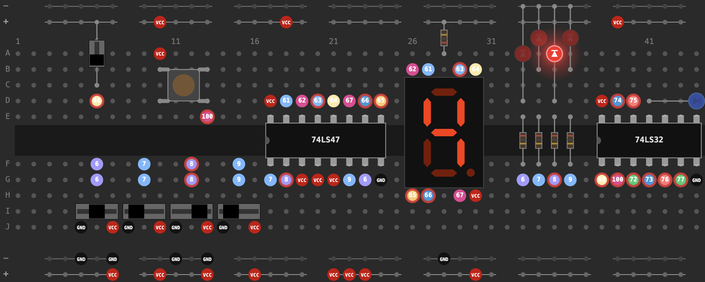

# [74SIM](https://74sim.com/)

A breadboard simulator for 74-series logic chips. Supports a range of 74-series and 4000-series chips, along with SPICE components including resistors, capacitors, LEDs, and diodes.

[Found a bug?](https://74sim.com/bug-report.html)
